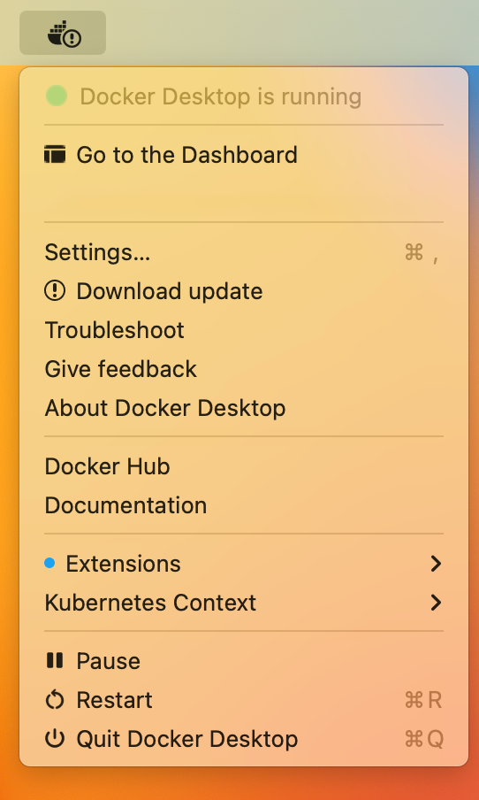
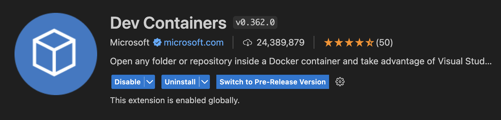
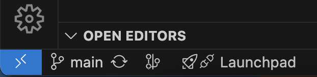
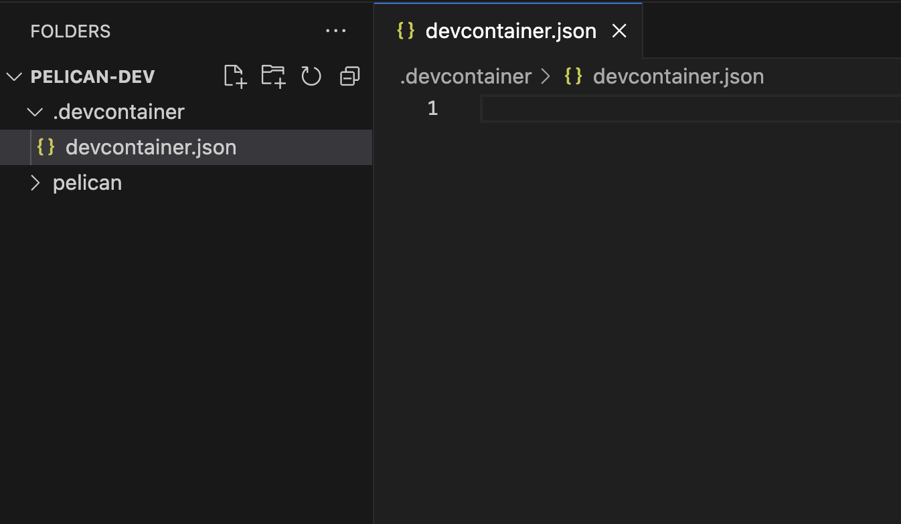
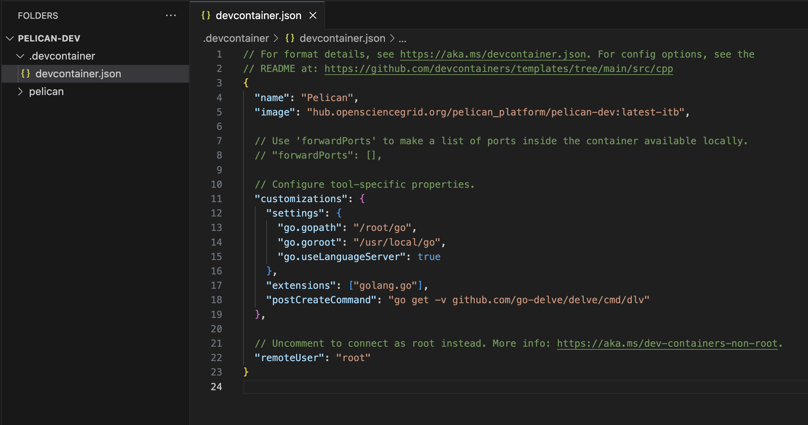
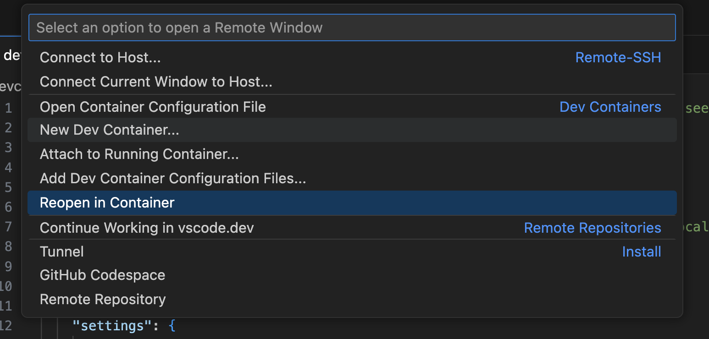
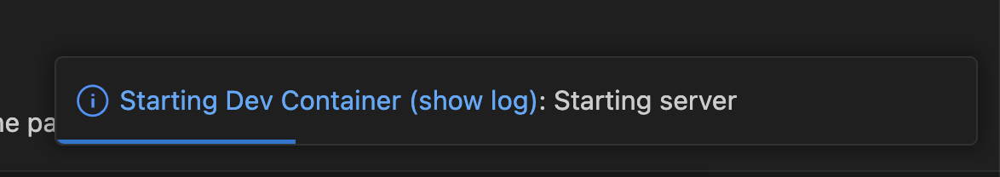
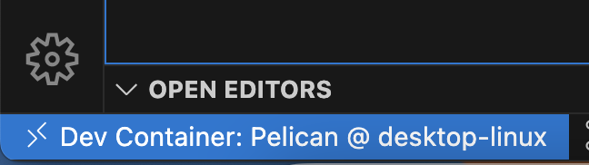
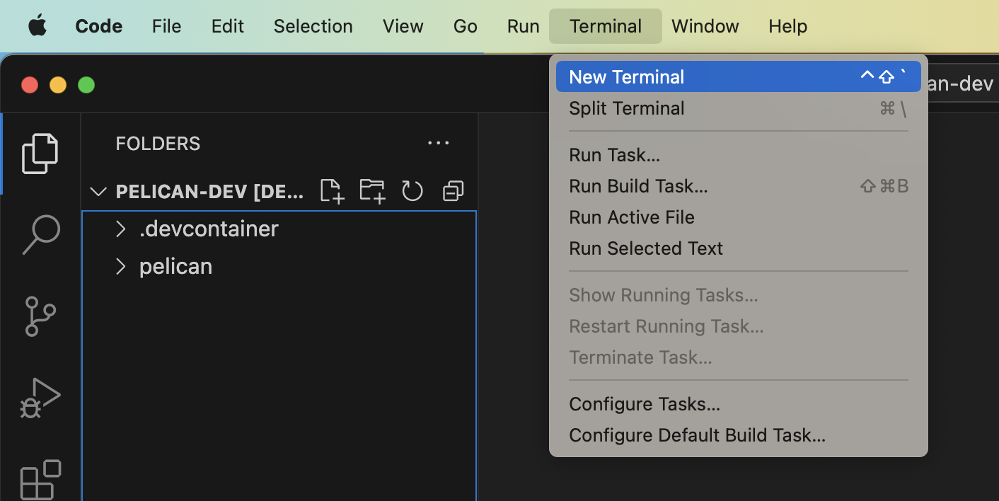
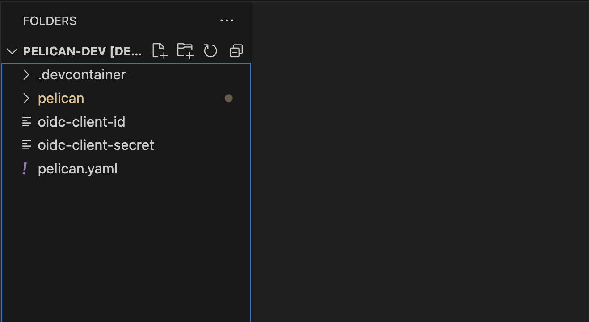

# Contributing to Pelican

Welcome! We are glad that you want to contribute to the Pelican project! 💖

As you get started, you are in the best position to give us feedback on areas of our project that we need help with including:

* Problems found during setting up a new developer environment
* Gaps in our Quickstart Guide or documentation
* Bugs in our automation scripts

If anything doesn't make sense, or doesn't work when you run it, please open a [bug report](https://github.com/PelicanPlatform/pelican/issues/new?assignees=&labels=bug&projects=&template=bug_report.md&title=) and let us know!

## Quicklinks

* [Ways to Contribute](#ways-to-contribute)
* [Tech Stack](#tech-stack)
* [Getting Started](#getting-started)
  * [Issues](#issues)
  * [Pull Requests](#pull-requests)
* [Development Environment Setup](#development-environment-setup)
* [Ask for Help](#ask-for-help)


## Ways to Contribute

We welcome many different types of contributions including:

* New features
* Builds, CI/CD
* Bug fixes
* Documentation

## Tech Stack

Pelican is developed based on the following tech stack:

* Pelican Server/Client
  * [Go](https://go.dev/)
  * [Gin](https://gin-gonic.com/) (HTTP server), [Viper](https://github.com/spf13/viper) (Configuration), [Cobra](https://cobra.dev/) (CLI), [Logrus](https://github.com/sirupsen/logrus) (Logging), [Gorm](https://gorm.io/) (ORM), [Goose](https://github.com/pressly/goose) (Database migration)
  * [OpenAPI V2.0](https://swagger.io/specification/v2/): API documentation
  * [SQLite](https://www.sqlite.org/): Database
* Pelican Server Website
  * [TypeScript](https://www.typescriptlang.org/)
  * [React](https://react.dev/)
  * [Next.js](https://nextjs.org/)

In addition, Pelican services rely on the following software dependencies:
* [XRootD](https://xrootd.slac.stanford.edu/): Underlying storage management software for Pelican Origin and Caches
* [Prometheus](https://prometheus.io/): Server observability and monitoring
* [OA4MP](https://github.com/ncsa/oa4mp): OAuth Server

## Getting Started

Contributions are made to this repo via Issues and Pull Requests (PRs). A few general guidelines that cover both:

* To report security vulnerabilities, please follow our [Security Policy](SECURITY.md).
* Search for existing Issues and PRs before creating your own.
* We work hard to makes sure issues are handled in a timely manner but depending on the priorities and developer availability, it could take a while to investigate the root cause.
* A friendly ping in the comment thread to the submitter or a contributor can help draw attention if your issue is blocking.

### Issues

Issues should be used to report problems with the software, request a new feature, or to discuss potential changes before a PR is created. When you create a new Issue, a template will be loaded that will guide you through collecting and providing the information we need to investigate.

If you find an Issue that addresses the problem you're having, please add your own reproduction information to the existing issue rather than creating a new one.

We have good first issues for new contributors and help wanted issues suitable for any contributor. [good first issue](https://github.com/PelicanPlatform/pelican/issues?q=is%3Aopen+is%3Aissue+label%3A%22good+first+issue%22) has extra information to help you make your first contribution. [help wanted](https://github.com/PelicanPlatform/pelican/issues?q=is%3Aopen+is%3Aissue+label%3A%22help+wanted%22) are issues suitable for someone who isn't a core maintainer and is good to move onto after your first pull request.

Sometimes there won’t be any issues with these labels. That’s ok! There is likely still something for you to work on. If you want to contribute but you don’t know where to start or can't find a suitable issue, you can start a [GitHub discussion thread](https://github.com/PelicanPlatform/pelican/discussions/categories/general) for ideas or questions.

Once you see an issue that you'd like to work on, please post a comment saying that you want to work on it. Something like "I want to work on this" is fine.

### Pull Requests

PRs to our software are always welcome and can be a quick way to get your fix or improvement slated for the next release. In general, PRs should:

- Only fix/add the functionality in question **OR** address wide-spread whitespace/style issues, not both.
- Add unit or integration tests for fixed or changed functionality (if a test suite already exists).
- Address a single concern in the least number of changed lines as possible.
- Include documentation in the repo under the [docs](./docs/) folder.

For changes that address core functionality or would require breaking changes (e.g. a major release), it's best to open an Issue to discuss your proposal first. This is not required but can save time creating and reviewing changes.

After you open the PR, it is required that at least one core contributor reviews and approves your changes. We monitor and triage new PRs and assign reviewers based on the scope of the PR. If your open PR is not reviewed after a week since it's open, please ping any of the core contributors as a reminder.

In general, we follow the ["fork-and-pull" Git workflow](https://github.com/susam/gitpr)

1. Fork the repository to your own Github account
2. Clone the project to your machine
3. Create a branch locally with a succinct but descriptive name
4. Commit changes to the branch
5. Following any formatting and testing guidelines specific to this repo
6. Push changes to your fork
7. Open a PR in our repository and follow the PR template so that we can efficiently review the changes.

## Development Environment Setup

We use Docker containers and VSCode Dev Container to setup our dev environment. We provide a pre-build Docker image for developers, which includes all the development dependencies. We also adapt additional container recipes for website development.

### Before Start

[Fork](https://docs.github.com/en/pull-requests/collaborating-with-pull-requests/working-with-forks/fork-a-repo#forking-a-repository) Pelican repository and [Clone](https://docs.github.com/en/pull-requests/collaborating-with-pull-requests/working-with-forks/fork-a-repo#cloning-your-forked-repository) your fork to your machine. The link is pointing to GitHub instructions where they use a demo repository. You need to replace it by https://github.com/PelicanPlatform/pelican

### Install and Start Docker

Follow the [instruction](https://docs.docker.com/get-docker/) from Docker to download and install Docker. You need Docker for running the development container.

After installation, for macOS and Windows user, start your Docker Desktop app and wait for a couple of minutes for Docker to start. If the whale icon is animated, it is probably still in the process of starting. You can click on the icon to see the status.




Run the following command to test your installation (the exact version may be different from what's shown below):

```bash
$ docker --version
Docker version 25.0.2, build 29cf629
```

### Install VScode

Follow the [instruction](https://code.visualstudio.com/download) to download and install VSCode. This is the IDE we use to develop Pelican.

Additionally, VSCode has a nice feature called Dev Container to streamline development inside a Docker container. We will go through how to set that up later.

### Pull Development Container

We host our dev container at `hub.opensciencegrid.org/pelican_platform/pelican-dev:latest-itb`. Pull the container with the following command:

```bash
$ docker pull hub.opensciencegrid.org/pelican_platform/pelican-dev:latest-itb

latest-itb: Pulling from pelican_platform/pelican-dev
Digest: sha256:9c49600a6edef303a9850584a548955f747b83661a7f536486523e3ade424997
Status: Downloaded newer image for hub.opensciencegrid.org/pelican_platform/pelican-dev:latest-itb
hub.opensciencegrid.org/pelican_platform/pelican-dev:latest-itb
```

### Setup Development Folder Structure

To make it easier configuring your local Pelican instance, we will store all the configuration files in a central spot. This includes the configuration for the Dev Container as well. To do so, you will need to create the following folder structure:

* Create a "development" folder as the root folder for the project

  ```bash
  $ mkdir pelican-dev
  ```

* Move your Pelican clone to the `pelican-dev` folder

  ```bash
  $ mv pelican pelican-dev
  ```

* Go inside the `pelican-dev` folder, which should look like this:

  ```bash
  $ cd pelican-dev
  $ ls
  pelican
  ```

### Setup Dev Container

* Open `pelican-dev` folder in VSCode
* Install the [Dev Container plugin](vscode:extension/ms-vscode-remote.remote-containers)

  

* Check installation
  With the Dev Containers extension installed, you will see a new Status bar item at the far left.

  

* Create a new folder named `.devcontainer` and create a new file named `devcontainer.json` in the folder. This is where the configuration of Dev Container lives. Below is what your folder will look like after creating the files:

  


* Copy and paste the provided configuration at [here](./dev/devcontainer.json) to `devcontainer.json`:

  

* Save the file and reopen your workspace in the dev container

  * `cmd + s` (macOS) or `ctrl + s` (Windows) to save the file
  * Click the Dev Container icon on the bottom left corner to open the menu. Click "Reopen in Container" to reopen your VSCode workspace in the dev container.

    

* Wait for Dev Container to start

  There will be a loading snackbar at the bottom-right corner while the Dev Container is starting. After a few seconds VSCode will be refreshed.

  

* Check you are connected to the Dev Container

  Once you are connected to the Dev Container, the bottom left status will show your connection status:

  

### Build Pelican from Source

We use [GoReleaser](https://goreleaser.com/) to manage compiling and distributing Pelican binaries. The Pelican development container comes with GoReleaser installed. To build Pelican, start a new terminal in your VSCode workspace:



> **Note**: the VSCode terminal you opened is connected to the *development container*, not your host machine. We will work inside the container for the rest of the instructions. Also note that the Dev Container plugin **mounts** your `pelican-dev` folder on your machine to the container, and any changes to your local `pelican-dev` folder is synced to the container.

First, in the terminal, navigate to the `pelican` folder:


```bash
$ cd pelican
```

Run the following command:

```bash
$ goreleaser build --single-target --clean --snapshot
```

Where:
* `build` is the command to build Pelican binaries
* `--single-target` is the argument to only build one binary that fits to your machine. By default, GoReleaser will build binaries for Linux, macOS, Windows, etc. For development purpose, you should only need one binary.
* `--clean` is the argument to remove existing build directory before building
* `--snapshot` is the argument to only build for development and testing, not for releasing

The build takes around 1-3 minutes to finish. It usually takes longer if this is your first time build Pelican. The following output means the build is successful:

```bash
...
  • building binaries
    • partial build                                  match=target=linux_arm64
    • building                                       binary=dist/pelican_linux_arm64/pelican
    • took: 3s
  • storing artifacts metadata
    • writing                                        file=dist/artifacts.json
  • build succeeded after 1m7s
  • thanks for using goreleaser!
```

The built artifacts including the binary are located under `pelican/dist`, the binary file for your OS should be located at `pelican/dist/pelican_linux_arm64/` if you are running an ARM machine.

```bash
$ cd /workspaces/pelican-dev/pelican/dist/pelican_linux_arm64
$ ls
pelican
```

Now you are able to run the built Pelican binary.

### Configure Pelican

If you are developing Pelican _Client_, you may skip the following content and dive right into it. However, if you are developing Pelican _Server_ components (Registry, Director, Origin, and Cache) or you want to set up your local federation. Follow the instruction below to configure Pelican.

* Setup a config file on your host machine
    * Create a new file in your VSCode workspace called `pelican.yaml`
    * Copy and paste the following content to the file:
      ```yaml
      TLSSkipVerify: true
      ```
* Link the config file to the Pelican config location
    The default location for Pelican config file is at `/etc/pelican/pelican.yaml` for root user. For non-root user, it's at `~/.config/pelican/pelican.yaml`

    * Go to `pelican-dev` folder in the container
    * Run the following command:
      ```bash
      $ rm -f /etc/pelican/pelican.yaml # Removes the default configuration file
      $ ln -s /workspaces/pelican-dev/pelican.yaml /etc/pelican/pelican.yaml # Soft link to your config file the Pelican config location
      ```
    * Verify that the file is linked:
      ```bash
      $ cat /etc/pelican/pelican.yaml
      TLSSkipVerify: true
      ```

* Create an empty file named `oidc-client-id` under `pelican-dev` folder and link to `/etc/pelican/oidc-client-id`. This file is required to run Pelican Registry and any other Pelican services if you want to enable server website login through OAuth.

* Create an empty file named `oidc-client-secret` and link it to `/etc/pelican/oidc-client-secret`. This is the OAuth client secret required for OAuth login.

Don't worry about the content of the files for now. We will set them up later.

* Get your [MaxMind](https://dev.maxmind.com/geoip/docs/databases/city-and-country) license key for running Pelican Director. Follow the instruction from our [docs](https://docs.pelicanplatform.org/serving_a_federation#get-maxmind-license-key-required) website. The license is free.

* Use the [template configuration file](./dev/dev_pelican.yaml) to start off. Copy and paste the content to your `pelican.yaml` file.

At this point, your VSCode workspace should have the following files and directories:



Where:
* `.devcontainer` is the Dev Container configuration files
* `oidc-client-id` is the empty file for OAuth client ID
* `oidc-client-secret` is the empty file for OAuth client secret
* `pelican` is the Pelican source code repository
* `pelican.yaml` is your Pelican configuration file

### Run Pelican Client

To run Pelican client, go to the folder where the built binary is located:

```bash
$ cd /workspaces/pelican-dev/pelican/dist/pelican_linux_arm64
```

and run Pelican client to fetch an object:

```bash
$ ./pelican object copy -f https://osg-htc.org /ospool/uc-shared/public/OSG-Staff/validation/test.txt downloaded-testfile.txt
```

This will download a test file from our OSDF federation to your current working directory. Check the object is downloaded:

```bash
cat downloaded-testfile.txt
Hello, World!
```

For client configuration and further details, refer to our [documentation website](https://docs.pelicanplatform.org/client-usage).

### Run Pelican Server

Running Pelican server requires different configuration based on server type. Please follow our documentation website to start a Pelican [Origin](https://docs.pelicanplatform.org/serving_an_origin), [Cache](https://docs.pelicanplatform.org/serving_a_cache), [Registry](https://docs.pelicanplatform.org/serving_a_federation#serve-a-registry), or the [Director](https://docs.pelicanplatform.org/serving_a_federation#serve-a-director).

To run a Pelican Registry, you need to setup a CILogon OAuth client. Follow the instruction [here](https://docs.pelicanplatform.org/serving_a_federation#get-oidc-credential-required) to proceed.

### Run a Local Pelican Federation

It is possible to set up your local Pelican federation and run central services as well as Pelican Origin/Cache on a single machine, or even a single process. We recommend using the "federation in a box" feature to run your local federation.

> Before running the local Pelican federation, you need to have MaxMind license key and CILogon OAuth client setup.

If you use the template configuration file, you need to change the `Federation.DiscoverUrl` to `https://<hostname>:8444` so that your local services are pointed to your local federation. Replace the `<hostname>` by the hostname of your container. You may get the `hostname` by running:

```bash
$ hostname
86fb8a78086b
```

To start "federation in a box", run the following command instead:

```bash
./pelican serve --module director,registry,origin,cache
```

This will spin up a fully functional Pelican local federation for you.

## Ask for Help

The best way to reach us with a question when contributing is to ask on the original github issue. Please comment your question under the issue and feel free to ping the author of the issue as you needed!

This guideline is based on [CNCF contributing guideline template](https://github.com/cncf/project-template/blob/main/CONTRIBUTING.md) and [Auth0 Contributing Guideline](https://github.com/auth0/open-source-template/blob/master/GENERAL-CONTRIBUTING.md).
