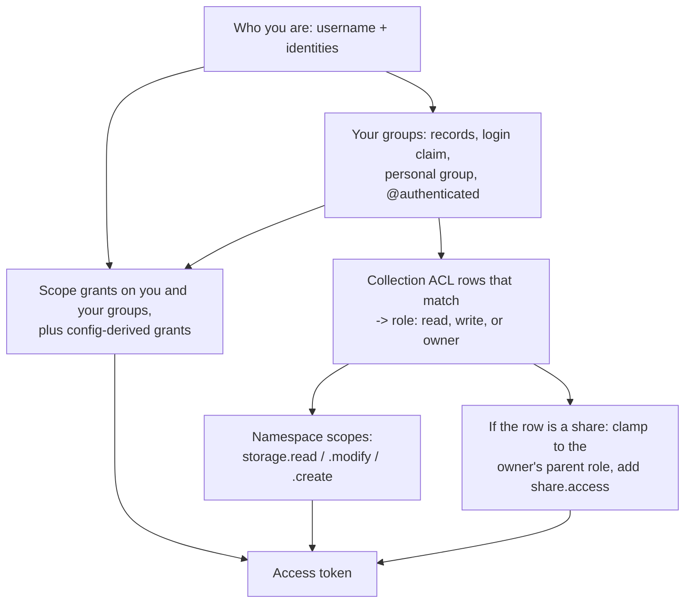

import { Callout } from 'nextra/components'

# How Access Control Works

A Pelican server answers two questions about every request: who is asking, and are they allowed.
This page explains how it answers them, so the tasks on the other pages in this section read as one model rather than a list of buttons.
For the authoritative "who may do what", go to the [Permissions Reference](/managing-data-access/permissions-reference).

## What access control is built from

A **user** is who you are.
A **group** is a name that several users answer to.
A **scope** is a permission the server has attached to a user or to a group.
A **collection** is a named prefix inside an exported namespace together with the list of groups allowed to read or write it.
A **share** is a child collection an ordinary user creates to hand part of their own access to someone else.

Authentication produces a user; authorization is always evaluated from the scopes and group memberships that user currently has, never from anything carried in the credential itself.
That is why revoking a group membership or a scope takes effect on the next request rather than when a token expires.

| Term | Definition | What it is NOT |
|---|---|---|
| User | A server-local record for a person or robot account, holding a username, a display name, and one or more linked login identities. | Not a permission. Having a user record grants nothing by itself. |
| Username | The machine-readable handle (`bockelman`). The only identity string authorization ever matches on. | Not the display name, not the OIDC subject, not the internal ID. |
| Display name | The human label shown in the interface (`Brian Bockelman`). Self-editable. | Never used for an authorization decision. |
| Internal ID | An opaque generated string used to address a record in URLs and API paths. | Not a credential and not an authorization handle; knowing it grants nothing. |
| Identity | An (issuer, subject) pair used to log in. A user may have several; each pair belongs to at most one user. | Not used for authorization. A matching subject never confers a matching username's privileges. |
| Group | A named set of users. Groups are what ACLs, admin lists, and authorization templates are written against. | Not a permission by itself, and not a folder — groups do not contain data. |
| Group owner | The one user who may rename ownership, delegate an administrator, delete the group, and who cannot leave it. | Not necessarily the creator; creating a group does not by itself confer ongoing authority. |
| Group administrator | A user or a group delegated day-to-day membership and metadata management on a group. | Cannot transfer ownership or delete the group. |
| Auth-template eligibility | A per-group flag that decides whether the group's *name* may match `Issuer.AuthorizationTemplates` and the `Server.*AdminGroups` lists. | Not a permission the group holds; it is permission for the group's name to be trusted as bearer authority. |
| Scope | A named capability (`server.admin`, `server.user_admin`, `server.collection_admin`, `web_ui.access`, `pelican.log_read`, …) attached to a user or a group. | Not a group and not a token claim you can hand-edit; the management API only accepts scopes from the user-grantable catalogue. |
| Effective scopes | The union of a user's direct scope grants, the grants on every group they belong to, and the grants implied by the operator's admin-list configuration. | Not a stored column — it is recomputed on every request. |
| Collection | A prefix inside an exported namespace plus its ACLs, visibility, owner, and optional admin group. | Not a directory, not a dataset object, and not a namespace — the export must already exist. |
| Collection owner | The single user responsible for a collection. The only principal who may transfer or delete it. | Not the same as the admin group, which can do everything except transfer and delete. |
| Collection ACL | A row granting a named group `read` or `write` on the collection until an optional expiry. | Not a per-user grant — per-user access is expressed through the implicit `user-<username>` group. |
| `@authenticated` | The virtual ACL target meaning "every signed-in caller". | Not a real group; it never appears in a token's group claim and cannot be created or joined. |
| Share | A child collection created by a user who holds read access on the parent, delegating a subset of that access to others. | Not a copy of the data, not a public link, and not something you can create on a multi-user origin backend. |
| Share owner | The user who created the share; data reached through the share is served as this user. | Not the parent collection's owner. |
| Invite link | A single-use or time-bounded token that, when redeemed, joins a group, sets a password, or transfers collection ownership. | Not a login credential and not an email — Pelican mints the link; a human delivers it. |
| AUP | The Acceptable Use Policy a user must accept before using the management surfaces. | Not a permission, and not something an administrator can accept on a user's behalf except by clearing and re-prompting. |

## Who you are, and what you may do

### Users are for authentication, not authorization

A user record exists so the server can recognize you across sessions and attribute actions to you; it carries no permissions of its own.
Most accounts appear by themselves on first sign-in, which is safe precisely because existence grants nothing.
Each user has one or more identities, an (issuer, subject) pair per login method, and an identity proves you are the same person as last time and nothing more.
A pair belongs to at most one user, so accounts cannot be quietly shared, and a subject that resembles somebody's name never confers that person's privileges.

Only the username is matched when the server decides whether you may act.
The display name is a label for humans, and the internal ID is a routing handle that appears in URLs and API paths because something has to address the record.

That has a consequence worth knowing before you edit a configuration file.
The username-matched administrator lists, such as [`Server.UIAdminUsers`](/parameters#Server-UIAdminUsers), compare against the server-managed username only, so an entry that is an OIDC subject grants nothing at all.
Pelican scans those lists at startup and logs an error naming every entry that can never match a username, so the lockout appears in your logs rather than as a mysterious login denial.
Administrator access for people identified by their identity provider comes from [`Server.AdminGroups`](/parameters#Server-AdminGroups) instead, which matches on group names.

### Groups are how authorization is written down

Because users hold no permissions, everything that grants permission is written against a group: collection ACLs, admin lists, and authorization templates all name groups.
Membership arrives from two directions — Pelican's own records, and the group names your login token asserts, filtered to names this server actually knows.
The two are unioned, which is why someone added to a group in the web interface sees the effect immediately instead of waiting for their identity provider to catch up.

Two names are synthesized rather than created.
Every user implicitly belongs to a personal group named `user-` followed by their username, which is how a per-user ACL grant is expressed without a second kind of ACL row.
`@authenticated` is the virtual target meaning "every signed-in caller", added to your group list whenever you have any identity at all; it begins with `@`, a character identifier validation rejects, so it can never collide with a real group name and nobody can create or join it.

Within a group there are three positions.
The owner may transfer ownership, delegate an administrator, and delete the group, and is the one member who cannot simply leave.
The administrator — a user or another group — handles membership and metadata day to day but cannot transfer or delete.
Members are everyone else and can always leave, which is why membership is never used to express a restriction.

Group names are unique across the server and cannot begin with `user-`.
Each group also carries an auth-template-eligibility flag, explained under [Where a scope can come from](#where-a-scope-can-come-from).
See [Managing Users and Groups](/managing-data-access/users-and-groups) for how to create and run one.

### Scopes name what an account may do

A scope is a named capability attached to a user record or a group record, and four of them shape this section.
`web_ui.access` is the baseline: the account may sign in and use the interface at all.
`server.user_admin` covers managing other people's accounts, `server.collection_admin` covers creating collections, and `server.admin` is the master scope that implies both — a system administrator is never granted the other two separately.

Scopes are not free-form.
The management API accepts only scopes from a fixed, user-grantable catalogue, and the effective-scope computation filters its output against that same catalogue.
That is a deliberate seam: a data-access scope such as `storage.read` is not in the catalogue, so no amount of granting through the management surface can hand one out.
Data-plane scopes are minted by the issuer, from collection ACLs, and by no other route.
The full catalogue is on the [Permissions Reference](/managing-data-access/permissions-reference#management-scopes).

### Where a scope can come from

Your effective scopes are not a stored column; they are recomputed on every request from several sources unioned together.
Direct grants on your user record come first, then grants on any group you belong to through Pelican's own records, then grants on any group your login token asserts by name.
On top of those sit the operator's configuration lists: the username-matched and group-matched admin settings, plus the built-in `admin` account.
Finally `server.admin`, from wherever it came, pulls in the two subordinate scopes.

The two kinds of source differ in how you take a permission back.
Configuration-derived grants are evaluated live against the file and never mirrored into the database, so editing the configuration withdraws them; database grants are withdrawn by revoking the grant.
Neither undoes the other, and a scope that arrived from configuration will not appear in a user's list of direct grants.
Two smaller behaviors follow the same "recompute, don't remember" principle.
New accounts receive the baseline named by [`Server.NewUserDefaultScopes`](/parameters#Server-NewUserDefaultScopes) at creation time only.
API tokens re-intersect against the creator's *current* effective scopes on every use, so a long-lived credential shrinks as its owner's privileges shrink.

Group creation itself is open.
Any signed-in user can create a group, because users need groups of their own to write collection ACLs and share ACLs against.
What a self-created group cannot do is act as bearer authority: [`Issuer.AuthorizationTemplates`](/parameters#Issuer-AuthorizationTemplates) and the [`Server.AdminGroups`](/parameters#Server-AdminGroups) settings match on a group's *name*, so a group you named yourself must not automatically start matching them.
Each group therefore carries an auth-template-eligibility flag, and only a system administrator can turn it on for an existing group.
Groups created before group creation was opened to everyone are eligible by default.
Collection ACLs do not consult the flag — those rows are set on the collection itself, and group names are unique.

## How access to data is granted

### Collections control access inside a namespace you already export

Exporting storage says which prefixes this origin serves and whether reads and writes are permitted there at all.
A collection is the finer-grained layer on top: a prefix *inside* an already-exported namespace, plus the ACLs saying which groups may read or write it.
It may be a sub-path rather than the whole export, so one export can carry many collections, and the path is canonicalized before it is checked and stored because that same string is later spliced into token scopes.

A collection cannot widen what the export permits.
If the export does not allow writes, no ACL row on a collection inside it produces a usable write.
Collections narrow and delegate; they never enlarge.

Three kinds of authority attach to a collection.
The owner is one user, responsible for it, and the only principal who can transfer or delete it.
The admin group runs it day to day — metadata, descriptive fields, ACLs, and reassigning the admin group itself — and can do everything except transfer and delete.
ACL rows grant `read` or `write` to a named group, optionally until an expiry, after which the row simply stops matching; holding `write` is authority over the collection's data, not over its access control.

Visibility is a separate axis: a public collection has its existence visible to callers who hold no ACL on it, and a private one does not appear in their listing at all.
Visibility grants no data access, and `@authenticated` — which does grant data access to every signed-in caller — does not make a collection public.
See [Collections and Shares](/managing-data-access/collections-and-shares) for the tasks.

### Shares delegate access you already hold

Creating a collection needs `server.collection_admin`, and most people who want to share data do not have it and should not need it — which is what shares are for.
A share is a child collection created by someone who already holds read access on the parent, once the parent's owner has turned sharing on.
The creator owns the share, so they can write ACLs on it exactly as a collection owner would, without gaining any new privilege on the parent.
A share's prefix has to be the parent's namespace or a path beneath it, shares start private, and a share of a share is refused.

Access through a share is always the weaker of two things: what the share grants its recipient, and what the share's owner can currently do on the parent collection.
That intersection is recomputed each time a token is *issued*, so if the share owner is downgraded from write to read — or loses access to the parent altogether — every token minted through the share from that point on is clamped or emptied.
A share cannot be used to delegate access its owner no longer has.

Refreshing an existing token does not re-run the intersection.
The issuer re-grants the scopes already stored on the session, so an already-issued token keeps its original access until it expires and a new authorization is performed.
Plan for access changes to take effect on the next issuance, not immediately.

Shares are not supported when the origin runs a multi-user POSIX backend ([`Origin.Multiuser`](/parameters#Origin-Multiuser)).
Serving share data means acting as the share's owner, and the multi-user backend cannot safely re-target the operating-system identity it serves a request under.
Creating a share on such an origin is refused with `409`, and if multi-user mode is turned on after shares already exist, any token carrying `share.access` is rejected outright rather than quietly falling back to the presenter's identity.

## How a request is decided

### How an access token is assembled

When the issuer mints an access token for you, it walks every collection you can reach and turns your role on each one into scopes.

Owner or `write` on a collection yields read, modify, and create on that collection's namespace; `read` yields read alone; no role yields nothing, because there is no implicit floor.
The namespace is made issuer-relative before it goes into a scope, so it lines up with the per-namespace tokens the storage layer validates, and a collection outside this issuer's namespace gets management-plane scopes only.
The token's group claim echoes the group names that actually matched an ACL, minus `@authenticated` — emitting a virtual target would invite downstream consumers to treat it as a real group.

A token issued for a share carries `share.access:/<share-id>` alongside its storage scopes.
That scope tells the origin to serve objects under the share's prefix as the share's *owner* rather than as the person presenting the token — which is what makes delegated access work.
It is minted by the issuer only; it is not a scope you can grant to a user or a group.
The full role-to-scope mapping is tabulated under [Data access](/managing-data-access/permissions-reference#data-access).

### Five roles, from system administrator to ordinary user

A **system administrator** holds `server.admin` and reaches every management surface: accounts, groups, scope grants, identity links, the Acceptable Use Policy, and every collection.
It is the only role that can grant a scope, and the only one that can make an existing group eligible for authorization templates and admin lists ([Roles](/managing-data-access/permissions-reference#roles)).

A **user administrator** holds `server.user_admin` and runs the account lifecycle: creating accounts, relabeling them, activating and deactivating them, minting password and onboarding invites, and recording or clearing policy acceptance.
Their reach stops short of granting scopes, editing identity links, and acting on a system administrator's account ([User administration](/managing-data-access/permissions-reference#user-administration)).

A **collection administrator** holds `server.collection_admin`, which buys exactly one thing nobody else can do: creating a collection.
Everything after that — running it, writing its ACLs, handing it to a PI — is ordinary collection authority ([Collection administration](/managing-data-access/permissions-reference#collection-administration)).

An **owner**, of a group or of a collection, holds authority that comes from being named on the row rather than from any scope: narrow, but total within its object.
An admin group can do nearly everything an owner can, minus transfer and delete, which is what makes it safe to delegate ([Group administration](/managing-data-access/permissions-reference#group-administration)).

An **ordinary user** holds `web_ui.access` and nothing else, which is more than it sounds.
They can create groups and own them, manage their own account, hold ACL grants, and — where sharing is enabled — create and run shares ([Share administration](/managing-data-access/permissions-reference#share-administration)).

### Three checks run on every request

Three checks run in sequence, and knowing which one refused you is usually enough to fix the problem.

The **login gate** establishes who you are and whether your account is still active, resolving your credential to a user record and collecting the group names your login asserts.
A deactivated account fails here on its next request, without waiting for a token to expire.

The **management-API gate** compares your effective scopes against what the route requires, and the Acceptable Use Policy gate sits alongside it.
If your server has an Acceptable Use Policy configured, you must accept the current version before you can use the user, group, or self-service management APIs.
Until you do, those endpoints return `403` with `requires_aup: true` and the version you need to accept, and the web interface sends you to the acceptance page.
Three things stay reachable so you can get unstuck: reading the policy, accepting it, and signing out.
Editing the policy is also exempt, so rotating it cannot lock out the administrator who rotated it.
[Acceptable Use Policy gate](/managing-data-access/permissions-reference#acceptable-use-policy-gate) lists which surfaces are gated and how the requirement is switched off.

The **row-level check** decides whether you may act on this particular record: are you its owner, are you in its admin group, does an ACL row match one of your groups, and is that row still within its expiry.
This is the layer that clamps a share against its owner's current access, and the layer a `write` ACL passes for data but not for ACL editing.

<Callout type="info">
Endpoints that would otherwise confirm a record exists return `404` rather than `403` when you are not allowed to see it.
A `404` on a collection or group you believe exists usually means you lack access, not that it is missing.
</Callout>
