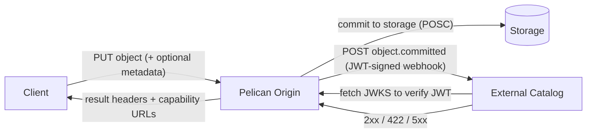
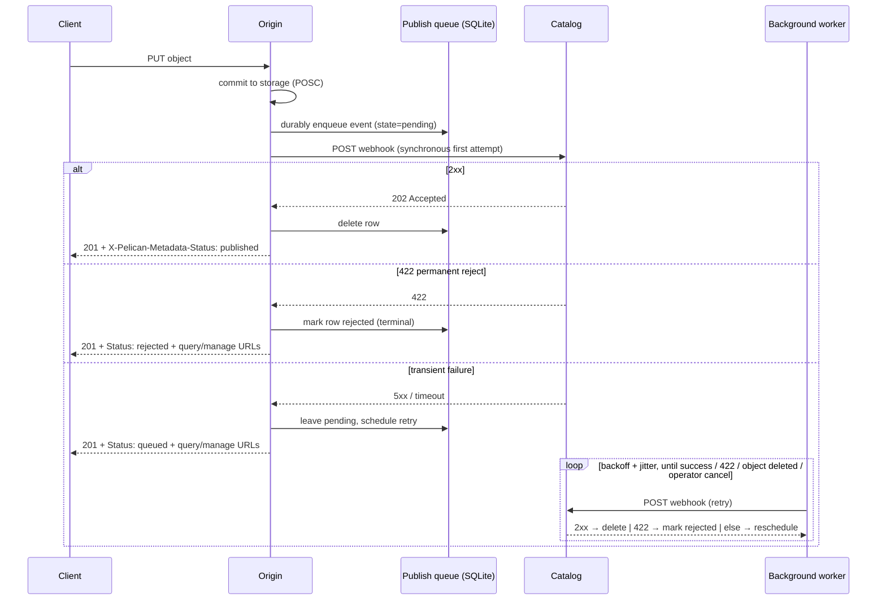
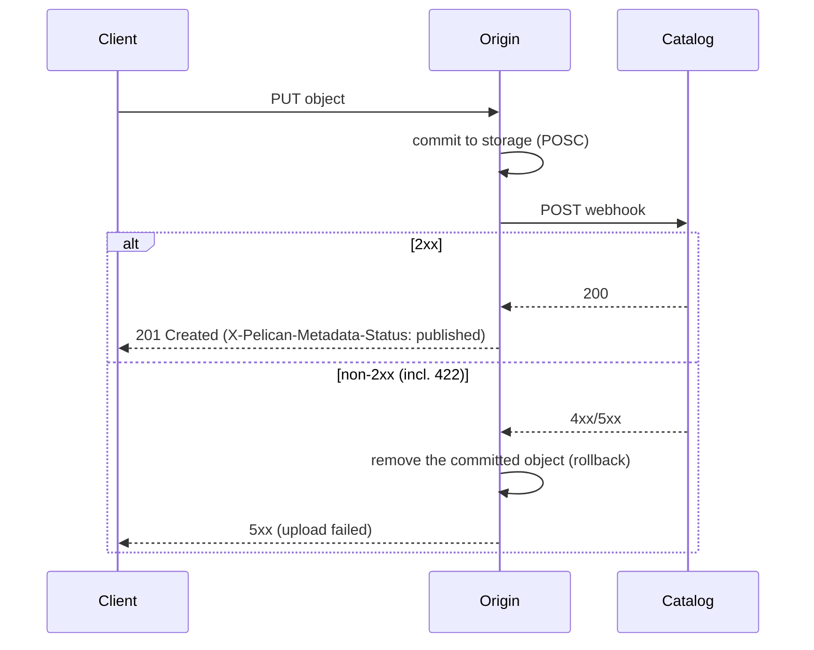

# Object-Commit Metadata Publishing — Design & Integration Guide

## 1. Overview

When a client uploads (or third-party-copies) an object to a Pelican V2 origin, the origin can **publish an "object committed" event to an external metadata catalog** — a webhook `POST` carrying the object's identity (path, size, ETag, timestamp) plus any uploader-supplied custom fields. Catalogs use this to build search indexes, audit logs, billing, dataset manifests, etc.

Two guarantees frame the whole design:

- **An event is only ever published for an object that actually committed to storage.** The publish hook fires *after* the object is durably renamed into place, never for a partial or failed upload.
- **The publish is authenticated.** Every webhook carries a short-lived JWT the catalog verifies against the origin's published keys. The catalog trusts the body only after the token checks out.



---

## 2. The webhook request (what the catalog receives)

A publish is a single HTTP `POST` to the configured endpoint (`Origin.Metadata.Endpoint`, or a per-export override).

```
POST /your/catalog/endpoint HTTP/1.1
Authorization: Bearer <JWT>
Content-Type: application/json
X-Pelican-Idempotency-Key: 8d9d5f3e-4f5b-4f1e-9c1f-2a8a7b1d6c43
User-Agent: pelican-origin-metadata/1

{
  "id":        "8d9d5f3e-4f5b-4f1e-9c1f-2a8a7b1d6c43",
  "type":      "object.committed",
  "timestamp": "2026-04-29T13:14:15Z",
  "namespace": "/foo",
  "object": {
    "path":       "/foo/bar.dat",
    "size":       12345,
    "etag":       "\"d41d8cd98f00b204e9800998ecf8427e\"",
    "created_at": "2026-04-29T13:14:15Z",

    "experiment": "atlas",
    "run_number": 4172,
    "is_test":    false
  }
}
```

Field notes:

| Field                   | Meaning                                                                                                                                                                         |
| ----------------------- | ------------------------------------------------------------------------------------------------------------------------------------------------------------------------------- |
| `id`                    | Stable UUIDv4 for this event. **Identical across redeliveries** — dedup on this. Also in `X-Pelican-Idempotency-Key`.                                                           |
| `type`                  | One of `object.committed` (new object), `object.updated` (overwrite or out-of-band change), `object.deleted` (removed). See [Lifecycle event types](#5a-lifecycle-event-types). |
| `timestamp`             | RFC 3339 time the event was generated.                                                                                                                                          |
| `namespace`             | The federation prefix (export) the object belongs to.                                                                                                                           |
| `object.path`           | **Federation-rooted** path of the committed object.                                                                                                                             |
| `object.size`           | Size in bytes.                                                                                                                                                                  |
| `object.etag`           | Backend-supplied ETag (quoted). Pelican does not invent its own hash.                                                                                                           |
| `object.created_at`     | Commit time.                                                                                                                                                                    |
| *other `object.*` keys* | Uploader-supplied custom fields (see below). Origin-computed keys always win over any client value.                                                                             |

**Custom fields.** The uploader may attach typed key/value pairs via the `X-Pelican-Object-Metadata` request header (an RFC 9651 Structured-Fields dictionary); the origin inlines them into `object`. The reserved keys `path`, `size`, `etag`, `created_at` are authoritative and cannot be spoofed by a client.

**Opaque blob variant (multipart).** If the uploader attached an opaque metadata blob (e.g. an XML manifest), the webhook is `multipart/related` instead: the first part is the JSON above (with an added `metadata` descriptor sub-object), the second part is the blob bytes with their original `Content-Type`. Catalogs that don't need blobs can ignore this and only accept `application/json`.

---

## 3. Verifying the token (required)

The `Authorization: Bearer <JWT>` is the **only** authentication. The body is untrusted until the token verifies. Verification steps:

1. Parse the JWT (without trusting it yet) to read its `iss` (issuer) claim.
1. Discover the issuer's keys: `GET <iss>/.well-known/openid-configuration`, read `jwks_uri`, then `GET` that JWKS. (Pelican serves it at `<iss>/.well-known/issuer.jwks`.) Cache and refresh it.
1. Verify the signature against the JWKS, and check:
   - `exp` (unexpired; a small clock-skew allowance is reasonable).
   - `aud` contains **your catalog's URL** (the endpoint the origin POSTs to). This stops a token minted for catalog A from being replayed against catalog B.
   - `scope` contains `pelican.metadata`, and — if you want to enforce it — a `pelican.metadata:/<namespace>` entry whose path covers the event's `namespace`. This stops an origin authorized for `/A` from publishing events claiming to be for `/B`.

Token claims summary:

| Claim         | Value                                                       |
| ------------- | ----------------------------------------------------------- |
| `iss` / `sub` | The origin's issuer URL                                     |
| `aud`         | Your catalog endpoint URL                                   |
| `scope`       | `pelican.metadata` (+ a path, e.g. `pelican.metadata:/foo`) |
| `jti`         | The event UUID (equals `id`)                                |
| `exp`         | Short-lived (default 5 minutes)                             |

> **Reference implementation:** Pelican ships a runnable, commented reference receiver at `cmd/sample_metadata_server` that performs exactly this verification. Use it to test your origin wiring and as a template.

---

## 4. How the catalog must respond (the contract)

Your HTTP status code drives the origin's behavior:

| Your response                                                                | Meaning                                                                                                                           | Origin behavior                                                                                                 |
| ---------------------------------------------------------------------------- | --------------------------------------------------------------------------------------------------------------------------------- | --------------------------------------------------------------------------------------------------------------- |
| **`2xx`**                                                                    | Accepted.                                                                                                                         | Done. Event removed from the origin's queue.                                                                    |
| **`422` Unprocessable Content**                                              | **Permanently bad** — this event will never be acceptable (malformed content, policy violation, unknown namespace you refuse, …). | **Stop.** No retries. Eventual mode marks the event terminal (`rejected`); transactional mode fails the upload. |
| **any other non-2xx** (incl. `401`, `403`, `5xx`) or a network error/timeout | Transient — try again later.                                                                                                      | Retried with exponential backoff (eventual mode) or fails this upload (transactional mode).                     |

**Why 422 is special.** Retrying a permanently-bad event forever wastes both sides' resources and ages the origin's health metric. Answer `422` *only* when reprocessing the identical event could never succeed. Use `4xx`/`5xx` (which keep retrying) for anything transient — including auth blips during key rotation, which you should **not** answer with `422`.

**Idempotency / delivery.** Delivery is **at-least-once**. The origin retries on failure and, in rare crash/lease-overlap windows, may deliver the same event twice. **Dedup on `id`** (`X-Pelican-Idempotency-Key`). Ordering is not guaranteed.

---

## 5a. Lifecycle event types

The `type` field distinguishes three lifecycle events. All share the JSON shape, JWT auth, idempotency, and the `422` permanent-reject contract above.

| `type`             | Emitted when                                                                                                                                                                       | `object` fields                                                                        |
| ------------------ | ---------------------------------------------------------------------------------------------------------------------------------------------------------------------------------- | -------------------------------------------------------------------------------------- |
| `object.committed` | A new object is committed (first write of a path).                                                                                                                                 | Full: `path`, `size`, `etag`, `created_at`, + custom fields.                           |
| `object.updated`   | An existing object is **overwritten** (a re-PUT of a path the origin already tracks) **or** the origin observes an **out-of-band modification** (a `Stat` finds a different ETag). | Full: `path`, `size`, `etag` (the new values).                                         |
| `object.deleted`   | An object is removed — a client `DELETE`, or an out-of-band deletion the origin observes.                                                                                          | `path` only meaningful; `size`/`etag` are `0`/empty. `timestamp` is the deletion time. |

Notes for catalog operators:

- **Dedup / ordering still apply per event.** Each event has its own `id`. A create→update→delete sequence for a path arrives as three events with three ids; ordering is not guaranteed, so use `timestamp` if you need to order them.
- **`object.deleted` is expected to reference a now-absent object** — don't treat "the object doesn't exist" as a reason to reject it.
- **Overwrite vs update:** an overwrite is reported as `object.updated` (not a second `object.committed`); the origin decides create-vs-overwrite purely from its local tracking DB.

**Delivery semantics differ by event type.** `object.committed` / `object.updated`-on-overwrite ride the upload's publish path (synchronous first attempt, and in transactional mode they gate the upload). `object.deleted` and `object.updated`-on-out-of-band-change are **always asynchronous best-effort**: the data change already happened and can't be rolled back, so they are queued and retried by the background worker regardless of mode, and never block or fail the triggering operation.

> **Prerequisite:** `object.deleted` and `object.updated` require the origin's local object-metadata tracking to be enabled for the export (`Origin.Exports[].Metadata.TrackAccess` / `Origin.Metadata.TrackAccess`) — that subsystem is what detects deletes and out-of-band changes. With publishing on but tracking off, only `object.committed` is emitted.

---

## 5. Publish modes

Configured per origin (or per export) via `Origin.Metadata.Mode`.

### Eventual consistency (default)

The origin makes **one synchronous first attempt** during the upload so the client learns the initial result, then returns success regardless; a background worker retries anything that didn't land.



- Retries: exponential backoff with full jitter, `MinBackoff`…`MaxBackoff`, bounded worker concurrency (`MaxInflight`), shared rate limit (`RatePerSecond`).
- The upload **always** succeeds once the object is committed and the event is durably enqueued — catalog health never blocks the data path.

### Transactional

The publish is synchronous and **gates the upload**: a non-2xx (including `422`) fails the `PUT` with a 5xx and the just-committed object is best-effort removed (so an object is never left committed without its metadata). No retries — the client is expected to retry the whole upload.



---

## 6. The uploading client's experience (eventual mode)

On the `PUT` response the origin sets:

- `X-Pelican-Metadata-Status`: `published` | `queued` | `rejected`.
- When the event persists (`queued`/`rejected`), two **capability URLs**:
  - `X-Pelican-Metadata-Query-Url` — `GET` it to read the publish status.
  - `X-Pelican-Metadata-Manage-Url` — `GET` reads status; `DELETE` cancels the publish.

These URLs embed long random tokens: **possessing the URL is the authorization** — no separate token is needed. The query URL is read-only; only the manage URL can cancel. (Operators can additionally manage the whole queue through the admin API, which is gated by the origin admin scope.)

> **Operator note:** because the token lives in the URL path, anything that logs full request URLs (HTTP access logs, reverse proxies) will capture it, and a log reader could cancel a client's publish. Scrub `/metadata_publish/<token>` paths from access logs, or restrict who can read them.

A `GET` returning `404` means the token is unknown *or* the publish already completed successfully (successful rows are deleted).

---

## 7. curl walkthrough

### 7a. Upload with custom metadata

```bash
curl -X PUT \
  -H "Authorization: Bearer $WRITE_TOKEN" \
  -H 'X-Pelican-Object-Metadata: experiment="atlas", run_number=4172, is_test=?0' \
  --data-binary @run99.dat \
  -D - \
  https://origin.example.org:8447/foo/data/run99.dat
```

Response headers (eventual mode, first attempt failed transiently):

```
HTTP/1.1 201 Created
X-Pelican-Metadata-Status: queued
X-Pelican-Metadata-Query-Url:  https://origin.example.org:8447/api/v1.0/origin_ui/metadata_publish/8Zreal0Random1Token
X-Pelican-Metadata-Manage-Url: https://origin.example.org:8447/api/v1.0/origin_ui/metadata_publish/9OtherRandomManage
```

### 7b. Check publish status (capability URL — no token needed)

```bash
curl https://origin.example.org:8447/api/v1.0/origin_ui/metadata_publish/8Zreal0Random1Token
```

```json
{
  "event_id": "8d9d5f3e-...",
  "namespace": "/foo",
  "object_path": "/foo/data/run99.dat",
  "state": "pending",
  "attempts": 3,
  "last_error": "http 503",
  "created_at": "2026-04-29T13:14:15Z",
  "next_attempt_at": "2026-04-29T13:16:47Z"
}
```

### 7c. Cancel a publish that's going nowhere (manage URL)

```bash
curl -X DELETE https://origin.example.org:8447/api/v1.0/origin_ui/metadata_publish/9OtherRandomManage
# {"event_id":"8d9d5f3e-...","cancelled":true}
```

### 7d. What the catalog does on receipt

Minimal shape of a compliant receiver (pseudocode; see `cmd/sample_metadata_server` for a real one):

```
on POST:
    tok = bearer_token(request)                     # 401 if missing
    iss = unverified_claims(tok).iss
    jwks = fetch(iss + "/.well-known/openid-configuration" -> jwks_uri)
    claims = verify(tok, jwks, audience=MY_URL)     # 401 if bad sig / aud / exp
    require "pelican.metadata" in claims.scope      # 403 otherwise
    event = json(body)
    if already_seen(event.id): return 200           # dedup (idempotency)
    if not acceptable(event): return 422            # permanent reject — origin stops
    store(event); return 202
```

---

## 8. Configuration reference (origin operators)

All under `Origin.Metadata.*`; `Endpoint`, `Mode`, and `Enabled` are also per-export overridable via `Origin.Exports[].Metadata.*`.

| Parameter                   | Default       | Purpose                                                |
| --------------------------- | ------------- | ------------------------------------------------------ |
| `Enabled`                   | `false`       | Master switch.                                         |
| `Endpoint`                  | (none)        | Catalog URL to POST to. Required when enabled.         |
| `Mode`                      | `eventual`    | `eventual` or `transactional`.                         |
| `RequestTimeout`            | `10s`         | Per-attempt HTTP timeout.                              |
| `TokenLifetime`             | `5m`          | Webhook JWT lifetime.                                  |
| `MinBackoff` / `MaxBackoff` | `30s` / `30m` | Eventual-mode retry backoff bounds.                    |
| `MaxInflight`               | `4`           | Worker concurrency.                                    |
| `RatePerSecond`             | `10`          | Shared publish rate limit.                             |
| `WarnAfter` / `ErrorAfter`  | `4h` / `24h`  | Health-state thresholds (age of oldest pending event). |

Prometheus metrics are exported under `pelican_origin_metadata_*` (queue depth, oldest-pending age, attempt outcomes, `rejected_total`, health state, …).

---

## 9. Origin internals

Where the pieces live in the Pelican source (`origin_serve/` unless noted):

| Concern                                                                                    | File                            |
| ------------------------------------------------------------------------------------------ | ------------------------------- |
| POSC commit + close hook (fires publish only after a successful rename)                    | `posc.go`, `close_notify_fs.go` |
| Close-hook → event construction; sync first attempt; retry/reject handling; result headers | `metadata_controller.go`        |
| One publish attempt (URL, JWT minting, JSON / multipart body); 422 → permanent reject      | `metadata_publisher.go`         |
| Event JSON shape (reserved keys authoritative)                                             | `metadata_event.go`             |
| Publish queue DAO (SQLite): enqueue, claim, retry, `markRejected`, capability-token lookup | `metadata_queue.go`             |
| Schema (`metadata_publish_queue`, `state` + capability tokens)                             | `database/origin_migrations/`   |
| Client capability endpoints (query / cancel; no auth — token is the capability)            | `metadata_status_api.go`        |
| Operator/admin queue API (admin-scope gated)                                               | `metadata_admin.go`             |
| Inbound `X-Pelican-Object-Metadata` header parse                                           | `object_metadata_header.go`     |
| Inbound multipart split (opaque blob)                                                      | `metadata_multipart.go`         |
| Metrics                                                                                    | `metadata_metrics.go`           |
| Reference receiver (standalone binary)                                                     | `cmd/sample_metadata_server/`   |

Key invariants worth preserving:

- The publish hook only fires after a successful POSC rename; a failed/short upload (or failed TPC) must `Abort()` the staged file so nothing publishes.
- Freshly-enqueued rows are given a future `next_attempt_at` (the "first-attempt grace") so the background worker never races the synchronous first attempt and double-publishes.
- Origin-computed reserved fields (`path`/`size`/`etag`/`created_at`) are written *after* client custom fields when marshaling, so a client can never override them.
- Delivery is at-least-once; receivers dedupe on the event `id`.
