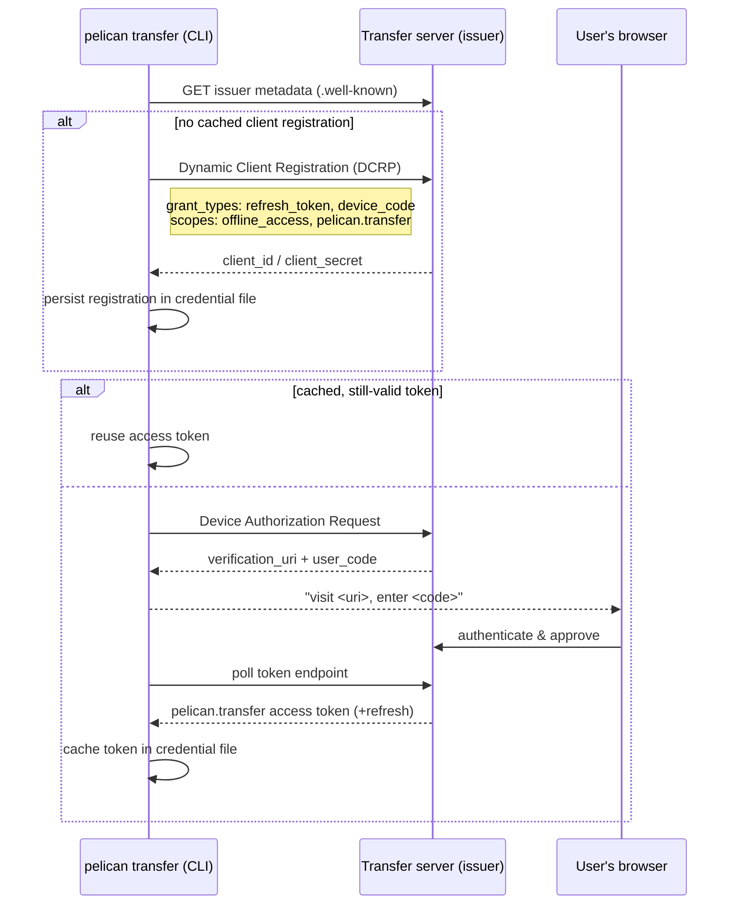
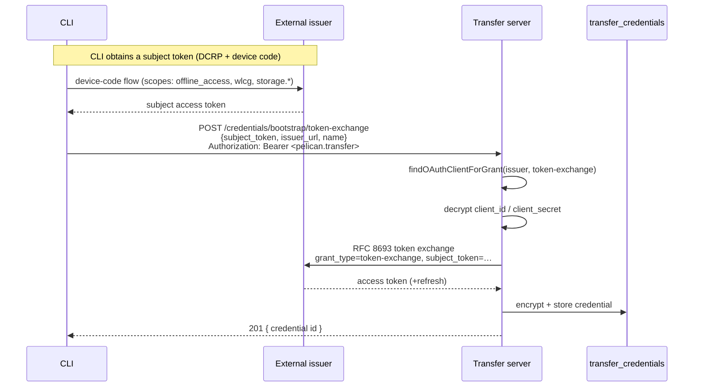
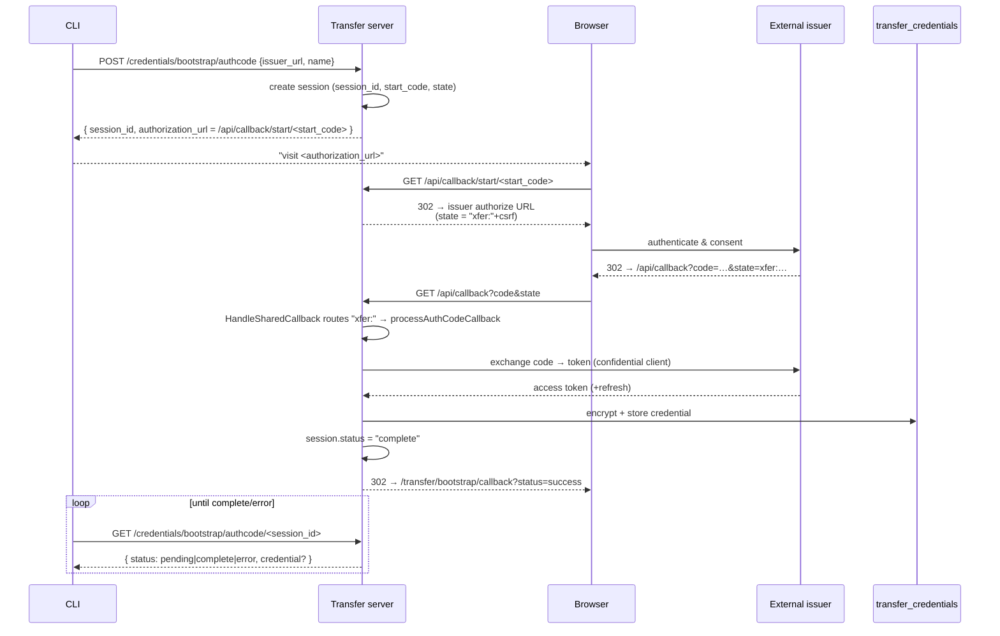
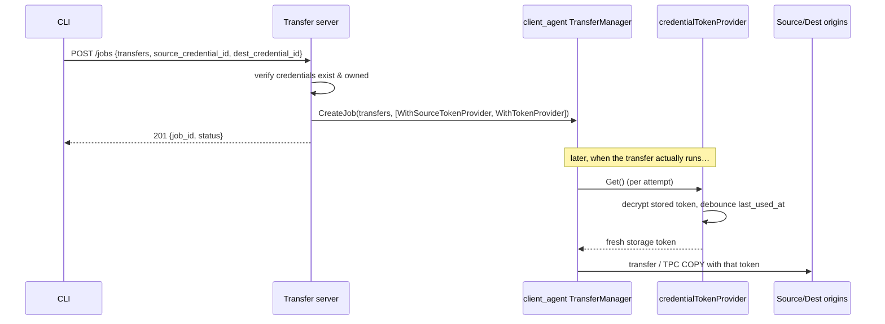

# Transfer Server Design

> **Status:** Design / architecture reference, reflecting the implementation in the `transfer/` package as of this branch.
>
> **Scope:** This document describes how the Pelican *transfer server* works, with particular emphasis on its OAuth2 flows. It is intended for developers working on the transfer module, not as end-user documentation.

## 1. Overview

The transfer server exposes the Pelican [`client_agent`](../client_agent/DESIGN-CLIENT-API-SERVER.md) transfer engine over an authenticated HTTP API. It lets a user submit managed (asynchronous, server-side) data transfers — including third-party copies (TPC) — and, crucially, it stores and brokers the **storage credentials** those transfers need so that the user does not have to ship long-lived tokens to the server on every request.

There are two distinct credential planes, and keeping them separate is the key to understanding the rest of this document:

| Plane | Token | Who mints it | Who consumes it | Purpose | |-------|-------|--------------|-----------------|---------| | **Control plane** | `pelican.transfer`-scoped JWT | The transfer server's **own** issuer | The transfer server's auth middleware | Authenticate the *user* to the transfer API | | **Data plane** | Storage tokens (`storage.read:/…`, etc.) | **External** OAuth2 issuers (e.g. a federation's token issuer) | Origins / caches during a transfer | Authorize the *data movement* itself |

The control-plane token answers "**who are you, and may you use this API?**". The data-plane credentials answer "**what storage are you allowed to touch?**". The OAuth2 machinery in this module exists almost entirely to acquire, encrypt, store, and later re-materialize data-plane credentials on the user's behalf.

Source files (all under `transfer/`):

| File | Responsibility | |------|----------------| | `transfer.go` | Module registration, route table, DB init, background cleanup | | `auth.go` | `TransferAuthMiddleware` — control-plane authentication & ownership | | `credentials.go` | Credential CRUD, decryption, dynamic `TokenProvider` | | `oauth_clients.go` | Per-issuer confidential OAuth client registry (CRUD) | | `bootstrap.go` | Credential **bootstrap** flows (token-exchange, auth-code) | | `handlers.go` | Transfer job submission/status; credential → transfer-option wiring | | `models.go` | GORM models and API request/response types |

The CLI counterpart lives in `cmd/transfer_*.go` (notably `cmd/transfer_bootstrap.go`).

## 2. Deployment modes

The same code runs in two modes:

1. **Standalone transfer server** (`server_structs.TransferType`). `launchers.LaunchModules` calls `transfer.RegisterTransferAPI`. All transfers the server can reach are permitted.

1. **Embedded in an origin** (`Origin.EnableTransferAPI = true`). `launchers.OriginServeFinish` calls `transfer.RegisterTransferAPIForOrigin`, which additionally pins `allowedPrefixes` to the origin's exported federation prefixes. Every submitted transfer must have its source *or* destination under one of those prefixes (`transferMatchesPrefixes` in `handlers.go`), so an origin-embedded transfer server can only move data into or out of its own namespaces.

Both modes share the server database (`database.ServerDatabase`) and the `transfer_*` tables created by the `20260412120000_create_transfer_tables.sql` migration.

## 3. Control-plane authentication

`TransferAuthMiddleware` (`auth.go`) guards every non-public route. The flow:

1. **Verify** the presented token via `token.VerifyAndExtract`, accepting it from the `Authorization` header **or** a `login` cookie (`token.Header`, `token.Cookie`), issued by either the local issuer (`Server.ExternalWebUrl`) or the federation issuer, and requiring the `pelican.transfer` scope (`token_scopes.Pelican_Transfer`).
1. **Fallback to the origin issuer.** When the transfer API runs inside an origin and `Origin.Url` differs from the web URL, a token rejected by the standard issuers is retried against the origin's issuer (`token.CheckOriginIssuer`). This lets origin-minted tokens drive the embedded transfer API.
1. **Resolve identity.** The token's `(issuer, subject)` pair is mapped to a row in the `users` table via `database.GetOrCreateUser`; the resulting user ID is stored on the gin context (`ctxKeyOwnerUserID`) and is the ownership key for every credential, OAuth client, and job.
1. **Group restriction (cookie only).** When `Transfer.EnabledGroups` is set, membership is checked against the token's `wlcg.groups` claim — **but only for cookie-sourced (web-UI) sessions.** Bearer tokens presented in the `Authorization` header carry an explicit `pelican.transfer` scope and are intentionally *not* subject to the group check. (See `TestGroupRestriction` for the codified behavior.)

### Obtaining the control-plane token (CLI)

The CLI (`authenticateWithTransferServer` in `cmd/transfer_bootstrap.go`) treats the transfer server as its own OAuth2 issuer:



The registration and tokens are stored in the local credential file as a `config.TransferServerEntry`, keyed by federation discovery URL + server URL. The resulting access token is sent as `Authorization: Bearer …` on all subsequent API calls.

## 4. Data-plane credentials

A **credential** (`transfer_credentials`) is an encrypted storage token owned by a user. It holds an encrypted access token, an optional encrypted refresh token, the issuing authority (`token_issuer`), and the granted `scopes`.

### 4.1 Encryption at rest

Secrets are encrypted before they touch the database and decrypted only when needed, through two choke-point helpers in `bootstrap.go`:

```
encryptSecret(plaintext)  → config.EncryptString(plaintext)
decryptSecret(ciphertext) → config.DecryptString(ciphertext)
```

> **Planned change (TODO in code):** the current `config.EncryptString` / `config.DecryptString` approach is intended to be replaced by a centralized, master-secret-based scheme (a master secret wrapped by the server's issuer keys, with a derived bootstrap secret). Routing all crypto through `encryptSecret`/`decryptSecret` means only one call site changes when that work lands.

The same helpers encrypt the confidential OAuth **client** secrets in `transfer_oauth_clients`.

### 4.2 Dynamic resolution at execution time

Credentials are **never** materialized into a transfer job at submission time. Instead, `credentialTokenProvider` (`credentials.go`) implements `client.TokenProvider` and decrypts the stored token *each time* `Get()` is called:

- This matters because a job may sit in a queue for hours before it runs; the token is fetched fresh when the transfer actually executes.
- `getDecryptedAccessToken` updates `last_used_at` with a 5-minute debounce (`lastUsedDebounce`) to avoid DB churn during recursive/multi-file jobs.

This is the consumer of the `client.WithTokenProvider` / `client.WithSourceTokenProvider` options in the client library — see §6.

### 4.3 Lifecycle / cleanup

`LaunchCredentialCleanup` runs a background goroutine (`runCredentialCleanup`) that deletes credentials idle longer than `Transfer.CredentialIdleTimeout` (default `168h`). The check interval is `timeout/2`, clamped to `[1 minute, 1 hour]`. A credential that has never been used is aged from its `created_at`.

## 5. OAuth2 credential bootstrap

"Bootstrapping" is how a user turns an identity at an **external** issuer into a stored data-plane credential. The transfer server supports three discovery results and two server-side exchange flows. Discovery is unauthenticated so a CLI can plan before authenticating.

### 5.1 Discovery: `GET /api/v1.0/transfer/auth-methods?issuer=<url>`

`handleGetAuthMethods` fetches the issuer's OIDC metadata (cached for 5 min by `globalIssuerCache`) and returns the methods that are *actually usable*:

| Method | Advertised when… | |--------|------------------| | `token_exchange` | Issuer advertises the RFC 8693 grant **and** a registered confidential client for it exists | | `authorization_code` | Issuer has an authorization endpoint **and** a registered client for `authorization_code` exists | | `device_code` | Issuer has a device-authorization endpoint (the CLI can drive it directly) |

The per-issuer confidential clients are looked up by `findOAuthClientForGrant`, which filters `transfer_oauth_clients` by issuer + grant type and prefers clients whose registered `scopes` cover the requested scopes (falling back to clients with no recorded scopes).

### 5.2 OAuth client registry

For the server to perform a token exchange or an authorization-code exchange, an operator (or user) must first register the external issuer's confidential client with the transfer server:

```
POST /api/v1.0/transfer/oauth-clients
{ name, issuer_url, client_id, client_secret, grant_types, scopes }
```

The `client_id` and `client_secret` are encrypted at rest. This registry is gated by `Transfer.EnableOAuth2Clients` (disabled by default → the endpoints return `403`).

### 5.3 Flow A — Token exchange (RFC 8693)

Used when the user can already obtain a *subject token* from the issuer (typically the CLI runs a device-code flow against the external issuer first). The server exchanges that subject token for a credential token using its registered confidential client.



Server entry point: `handleTokenExchangeBootstrap` → `performTokenExchange` (`bootstrap.go`). The exchange runs with the Pelican HTTP transport injected into the context so it honors the server's TLS configuration.

### 5.4 Flow B — Authorization code (browser, server-driven)

Preferred when available, because the user just clicks a link and the server handles the entire exchange. Two design points are worth calling out:

- **A short, opaque "start code" decouples the redirect from the session.** The session ID (used for polling) is **not** placed in the URL printed to the terminal. Instead a separate random `start_code` is, so an observer of the terminal cannot poll for — and steal — the resulting credential. The browser visits `/api/callback/start/<start_code>`, and only then does the server 302 to the real (long, meta-character-laden) issuer URL it stored.
- **A shared callback dispatcher.** All modules share `GET /api/callback`; the OAuth2 `state` parameter is prefixed (`xfer:` for transfer) so `HandleSharedCallback` can route the response to the right handler.



Server entry points: `handleAuthCodeBootstrapStart`, `handleStartRedirect`, `HandleSharedCallback` → `processAuthCodeCallback`, and `handleAuthCodeBootstrapPoll`. The poll endpoint enforces ownership (`session.Owner.UserID == owner.UserID`) and deletes the session once it is reported complete.

Bootstrap sessions live in an **in-memory** store (`bootstrapSessionStore`), expire after 10 minutes, and are swept every 5 minutes (`LaunchBootstrapSessionCleanup`). They are deliberately not persisted — a consequence is that the auth-code flow is **not** highly available across a multi-replica deployment (the callback and the poll must reach the same process). See §9.

### 5.5 Flow C — Device code (CLI-driven)

There is no dedicated server endpoint that completes a device-code flow into a credential. Instead, `device_code` is the mechanism the **CLI** uses to obtain a subject token from the external issuer, which then feeds Flow A (token-exchange). The CLI's `bootstrapCredential` orchestration (`cmd/transfer_bootstrap.go`) selects, in order:

1. `authorization_code` (Flow B) if advertised, else
1. `token_exchange` (Flow A), obtaining the subject token via `acquireTokenFromIssuer` (DCRP + device code against the external issuer, requesting `offline_access`, `wlcg`, plus the caller's `storage.*` scopes).

### 5.6 Direct credential creation

A user who already holds a storage token can skip OAuth entirely:

```
POST /api/v1.0/transfer/credentials
{ name, access_token, token_issuer? }
```

`handleCreateCredential` encrypts and stores it as a `bearer` credential.

## 6. Transfer jobs and credential wiring

Job submission ties the two planes together. `handleCreateTransferJob`:

1. Optionally enforces `allowedPrefixes` (origin-embedded mode).

1. Calls `buildTransferOptionsWithCredentials`, which converts referenced credentials into **dynamic token providers** rather than baked-in strings:

   | Request field | Client option | Meaning | |---------------|---------------|---------| | `source_credential_id` | `client.WithSourceTokenProvider` | Token for the **source** server (sent on the source HEAD/GET, and forwarded to the destination as `TransferHeaderAuthorization` for TPC pulls) | | `dest_credential_id` | `client.WithTokenProvider` | Token for the **destination** server (the primary `Authorization` header) |

1. Hands the transfers + options to the `client_agent.TransferManager`, and persists a `transfer_jobs` row (owner, credential references, request body).



The `client.TokenProvider` plumbing in the client library (`WithTokenProvider`, `WithSourceTokenProvider`, and `tokenGenerator.SetExternalProvider`) exists specifically to support this late-binding of credentials.

Job status (`handleGetTransferJob` / `handleListTransferJobs`) prefers the live status from the `TransferManager`, falling back to status derived from the persisted row (`deriveJobStatus`) when the in-memory job has been evicted or the server restarted.

## 7. Data model

```
users (existing)
  └──< transfer_credentials      (id, user_id FK, name, credential_type,
  │                               encrypted_access_token, encrypted_refresh_token,
  │                               scopes, token_issuer, token_expiry, last_used_at)
  │        ▲             ▲
  │        │ source      │ dest
  └──< transfer_jobs ────┘        (id, user_id FK, agent_job_id FK→jobs,
  │      (request_body, error, completed_at, …)
  └──< transfer_oauth_clients     (id, user_id FK, name, issuer_url,
                                   encrypted_client_id, encrypted_client_secret,
                                   grant_types, scopes)
```

- All three tables `FK → users(id) ON DELETE CASCADE` (a deleted user's credentials/clients/jobs are removed).
- `transfer_jobs.agent_job_id → jobs(id) ON DELETE SET NULL` links to the `client_agent` engine's own job row; the credential FKs are `ON DELETE SET NULL`.
- `(user_id, name)` is unique for both credentials and OAuth clients.

## 8. API surface

Public (no auth):

| Method | Path | Handler | |--------|------|---------| | GET | `/api/v1.0/transfer/ping` | `handlePing` | | GET | `/api/v1.0/transfer/auth-methods` | `handleGetAuthMethods` | | GET | `/api/callback` | `HandleSharedCallback` | | GET | `/api/callback/start/:code` | `handleStartRedirect` |

Authenticated (`pelican.transfer` scope, via `TransferAuthMiddleware`):

| Method | Path | Handler | |--------|------|---------| | POST/GET | `/credentials`, `/credentials/:id` (GET, DELETE) | credential CRUD | | POST | `/credentials/bootstrap/token-exchange` | `handleTokenExchangeBootstrap` | | POST | `/credentials/bootstrap/authcode` | `handleAuthCodeBootstrapStart` | | GET | `/credentials/bootstrap/authcode/:session_id` | `handleAuthCodeBootstrapPoll` | | POST/GET/DELETE | `/oauth-clients`, `/oauth-clients/:id` | OAuth client CRUD | | POST/GET/DELETE | `/jobs`, `/jobs/:job_id` | transfer job management |

## 9. Security & operational notes

- **Two scopes of trust.** A `pelican.transfer` token only authorizes *use of the API*; it conveys no storage rights. Storage rights live in the encrypted credentials, which are bound to the resolved user and never returned by the API (the `-`/omitted JSON tags on token fields).
- **Secrets at rest.** Access tokens, refresh tokens, and OAuth client secrets are all encrypted before storage; the encryption scheme is slated to move to a master-secret design (§4.1).
- **Auth-code session locality.** Because bootstrap sessions are in-memory, the browser callback and the CLI poll must hit the same server process. A multi-replica deployment needs sticky routing for `/api/callback*` and the poll endpoint, or a shared session store, before the auth-code flow is HA.
- **Start-code vs. session-id separation.** The auth-code flow deliberately keeps the pollable session ID out of the terminal-visible URL.
- **Group gating is cookie-only by design.** API bearer tokens bypass `Transfer.EnabledGroups`; restrict issuance of `pelican.transfer` tokens accordingly if group confinement matters for programmatic access.
- **Origin-embedded confinement.** In origin mode, `allowedPrefixes` ensures every transfer touches the origin's own namespaces.

## 10. Configuration parameters

| Parameter | Default | Purpose | |-----------|---------|---------| | `Origin.EnableTransferAPI` | `false` | Enable the embedded transfer API on an origin | | `Transfer.EnableOAuth2Clients` | `false` | Allow OAuth client registration/management | | `Transfer.EnabledGroups` | (empty) | Restrict cookie/web-UI access to these `wlcg.groups` | | `Transfer.MaxConcurrentJobs` | `5` | Transfer-manager concurrency | | `Transfer.CredentialIdleTimeout` | `168h` | Idle credential cleanup threshold | | `Transfer.DbLocation` | (falls back to `Server.DbLocation`) | Transfer DB path |

## 11. Known limitations / future work

- Master-secret-based encryption for credentials and client secrets is not yet wired in (§4.1).
- Bootstrap sessions are in-memory only; the auth-code flow is not HA (§9).
- `device_code` is surfaced by discovery but completed by the CLI feeding token-exchange; there is no standalone server-completed device-code-to- credential endpoint (§5.5).
